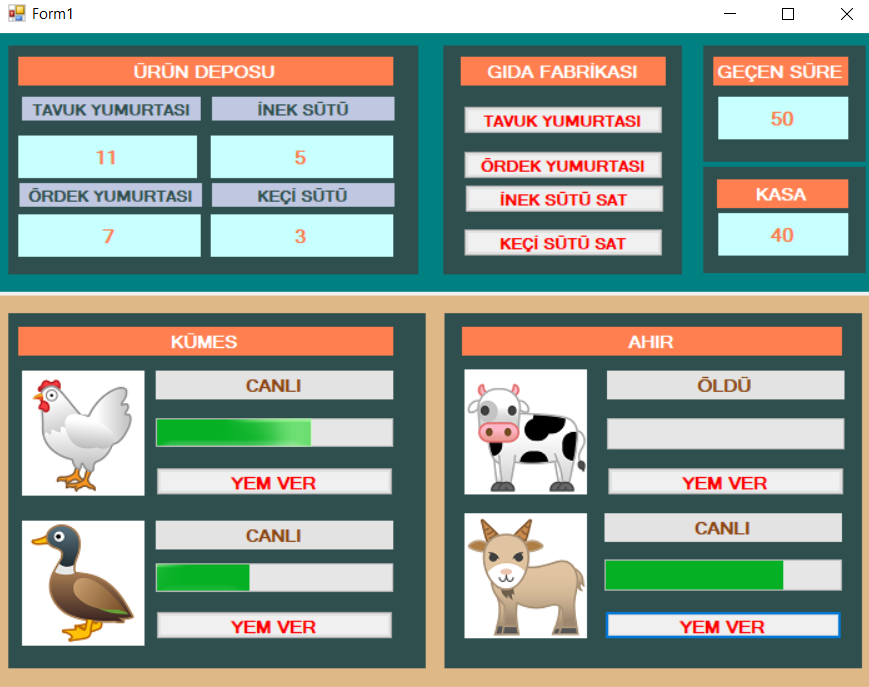

# Hayvan Çiftliği Oyun

- oop ile yazılmış basit bir oyun
- uygulama içinde kalıtım, kapsülleme, soyutlama ve çok biçimlilik gibi bir çok özellik kullanılmıştır.
- Ayrıca interface'lerden de yararlanılmıştır.
- Oyunda hayvanlar yem verdiğimiz sürece yaşar, yaşadığı sürece besin üretir, ölürken ses çıkarırlar.
- Hayvanların verdiği besinler oyun sırasında satılabilir ve bunların parası kasa da birikir.

Oyuna ait ekran görüntileri :
 

---
